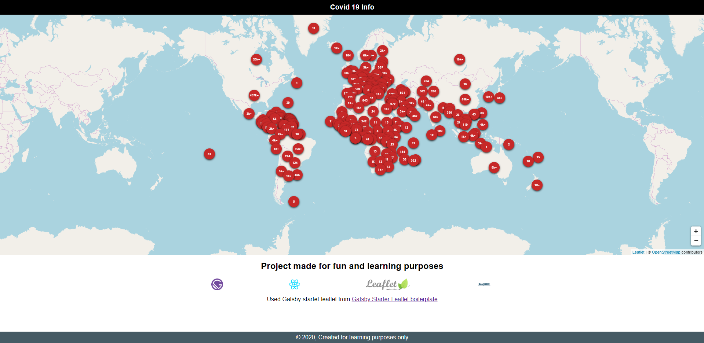
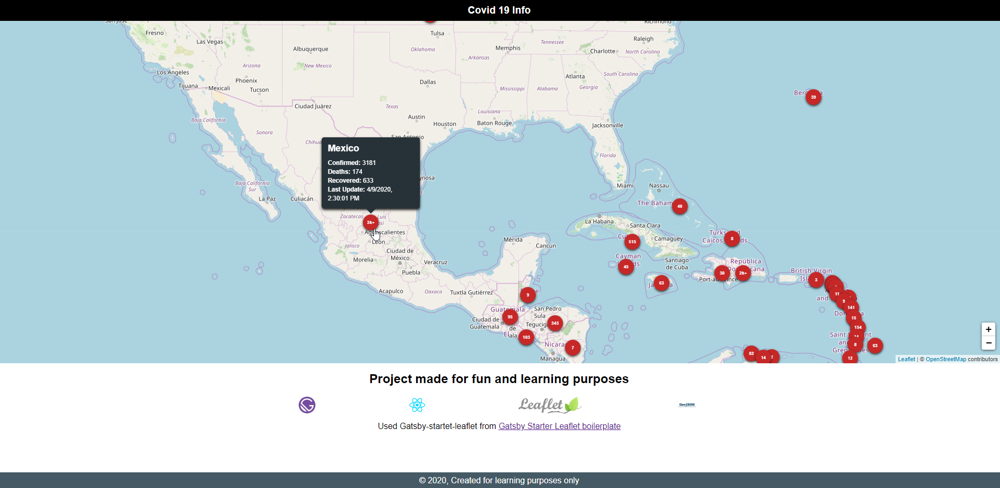

# Novel Covid map 🚨🚑🚨 --> https://vigilant-wiles-f9cd06.netlify.com

Map that shows some red markers, each marker shows the number of confirmed covid 19 cases, if you hover over the marker additional info will be displayed, such as number of deaths 💀, number of people who have recovered 💪 and the moment when the info was last updated.

Technologies used: Gatsby, Leaflet, GeoJson and React.

How the project looks like:

If you hover over one of the markers:

Used Gatsby Leaflet Starter from <a href="https://github.com/colbyfayock">https://github.com/colbyfayock,

</a> https://github.com/colbyfayock/gatsby-starter-leaflet

